# SBA Small-Business Credit Risk: from loan data to an approval cut-off

**One-line summary:** a leakage-controlled, out-of-time-validated, calibrated probability-of-default (PD) model for SBA 7(a)/504 small-business loans, turned into an
expected-loss framework, a recommended approval cut-off and pricing guidance, and served through a tested, Dockerised REST API.

> ### ⚠️ Read this first: what the numbers in this repo are (and are not)
> The environment this project was built in **could not reach `sba.gov` / `data.sba.gov`** (HTTP 403 from the network egress policy; I did not try to work around it).
> So the committed results were produced on a **synthetic stand-in dataset** that reproduces the SBA FOIA *schema* and stylised facts (start-ups and restaurants riskier, long-term loans safer, post-crisis and COVID vintages worse).
> **The default process was written by me, so every metric below demonstrates the *method*; none of it is evidence about real SBA borrowers.**
> The pipeline is built for the real files: put the SBA CSVs in `data/raw/real/` (or run `python -m src.data_download` from a machine with access) and `make train notebooks` regenerates every number, plot and the model. Real data takes precedence over synthetic automatically.
> The header of each notebook and `GET /model-info` state which data source was used.

---

## 1. The business problem (non-technical version)
A lender approving a small-business loan is betting the borrower will not default. Approve too many risky loans and losses eat the profit; decline too many good ones and you lose business.
This project answers three questions with data:
1. **How likely is each loan to default within 3 years?** (a probability, the PD)
2. **What does that mean in dollars?** (expected loss = PD × loss-given-default × exposure)
3. **Where should we draw the approval line, and how should we price the risk?**

## 2. Approach at a glance
```
SBA FOIA 7(a)+504 CSVs ─► harmonise + define 36-month default label ─► leakage-safe features (origination info only)
   ─► out-of-time split (train 2010-16 | calibrate 2017-18 | test 2019-21) ─► logistic baseline vs LightGBM (forward-chaining CV)
   ─► calibration ─► expected loss (PD×LGD×EAD) ─► cut-off + pricing ─► FastAPI + Docker + tests
```
| Design choice | Why |
|---|---|
| **Target:** charged off within **36 months** of first disbursement | Fixed horizon makes vintages comparable; only loans with a full observed window are labelled (younger loans are right-censored, not "good") |
| **Leakage control** (see §4) | FOIA rows mix origination fields with outcome fields; using the latter gives fake ~1.0 AUC |
| **Out-of-time validation** | Default rates move with the economic cycle; a random split lets the model peek at the future cycle |
| **Forward-chaining CV** for tuning | Same logic inside the training window: never train on years after the validation year |
| **Calibration on a later window** | Probabilities, not just rankings, drive expected loss |

## 3. Key results (synthetic stand-in data - see warning above)
Sample after filtering: **105,916 labelled loans**, overall 36-month default rate **7.5%** (train 7.4% · validation 6.6% · test 8.4%).

| Out-of-time test (2019-21) | AUC | Gini | KS |
|---|---|---|---|
| Logistic regression (baseline) | 0.684 | 0.369 | 0.267 |
| LightGBM (shipped) | **0.689** (95% CI 0.677-0.702) | 0.377 | 0.274 |

**Honest reading:** gradient boosting is *not materially better* than the linear baseline here (+0.004 AUC, inside the CI; logistic actually wins the CV). I ship LightGBM because it led on the validation window, handles missing/non-monotone effects natively and gives exact per-loan reason codes; the logistic model remains a fully defensible scorecard alternative. The top decile of scores has ~9x the default rate of the bottom decile.

<p align="center">
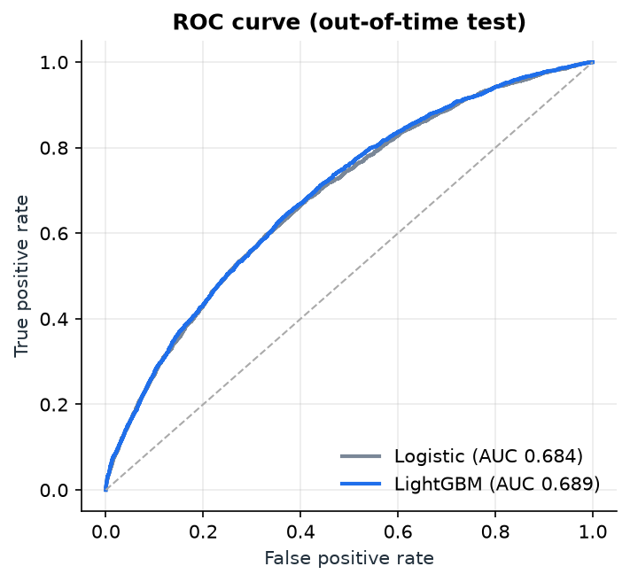 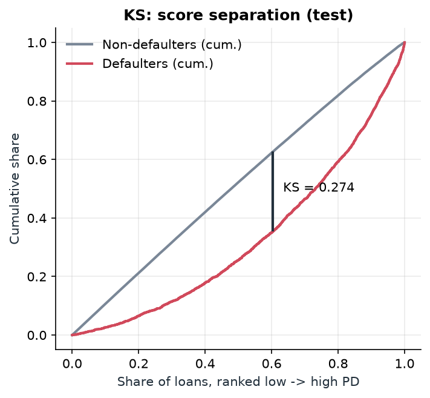 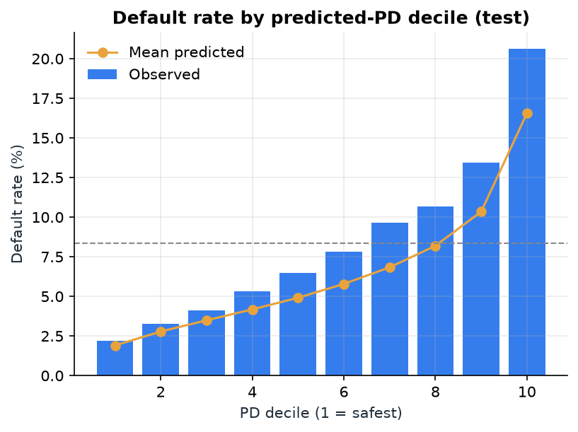
</p>

### Calibration: do predicted PDs match reality?
* **In the calibration window (2017-18):** yes: Platt scaling (chosen over isotonic by out-of-vintage Brier) aligns mean PD with the observed rate.
* **Out of time: no, and the reason is instructive.** On 2019-21 the observed default rate was **8.4% vs 6.5% predicted**; the worst gap is **2020 (10.2% observed vs 6.4% predicted)**. Score PSI is tiny (0.005): the *borrower mix* did not change and ranking held; the *base rate* moved with the economic cycle. Calibrating on a benign window cannot protect against a later regime change (test ECE 0.019 after calibration vs 0.013 raw). I report that rather than hide it; the remedy is monitoring + periodic intercept recalibration (or a macro overlay), and the business analysis is stress-tested for it.

<p align="center">
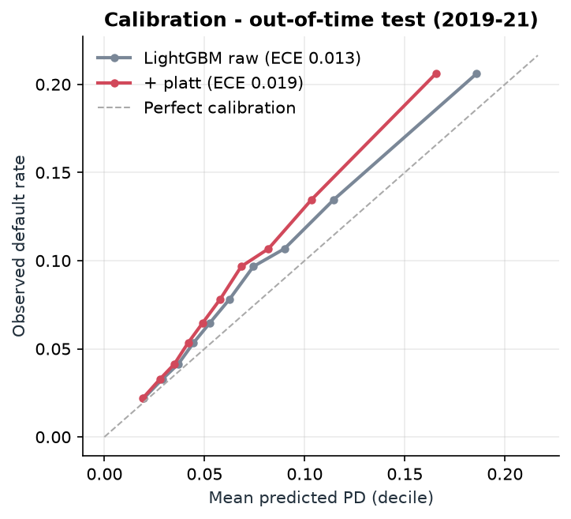 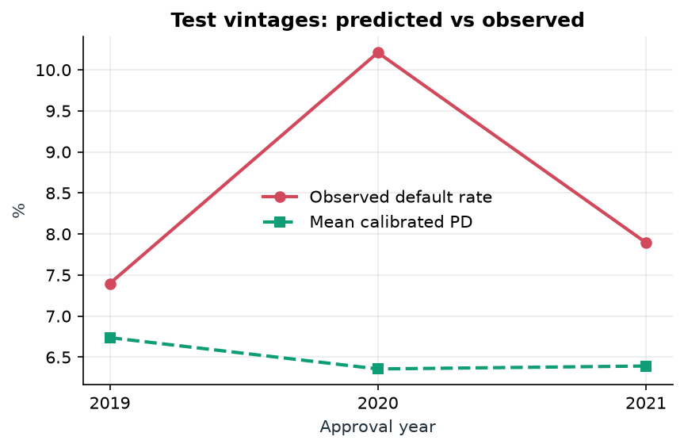
</p>

### What drives risk (permutation importance + SHAP)
Business age (start-ups highest risk) → loan term (short-term riskier) → loan size (smallest riskiest) → industry (food/hospitality, arts, construction up; health care, real estate down) → processing method & collateral → rate spread over prime (lender pricing carries real signal but is far from sufficient). *On synthetic data this ordering reflects how the generator was built; on real data re-read it from the same plots.*

<p align="center">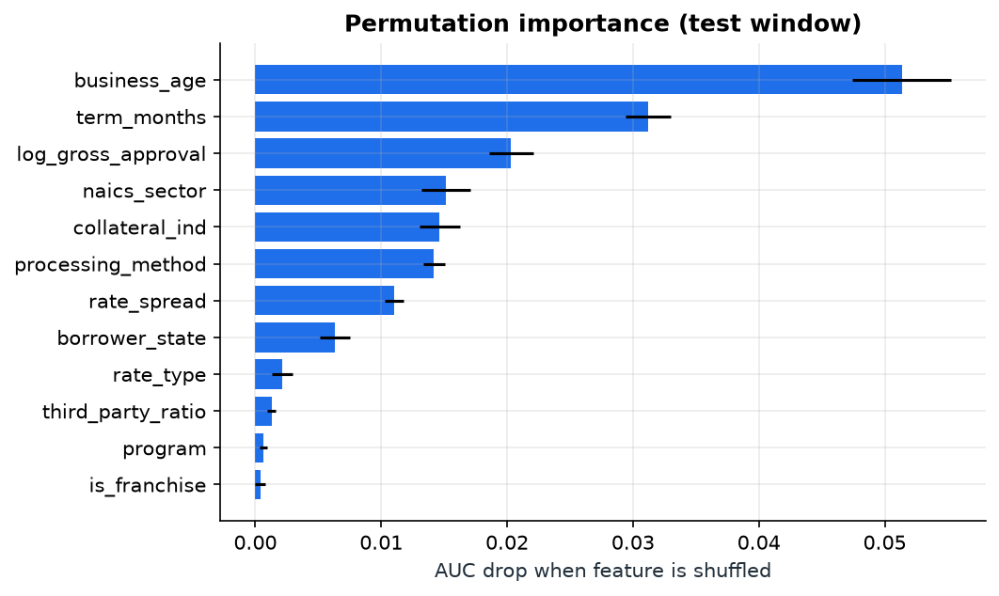 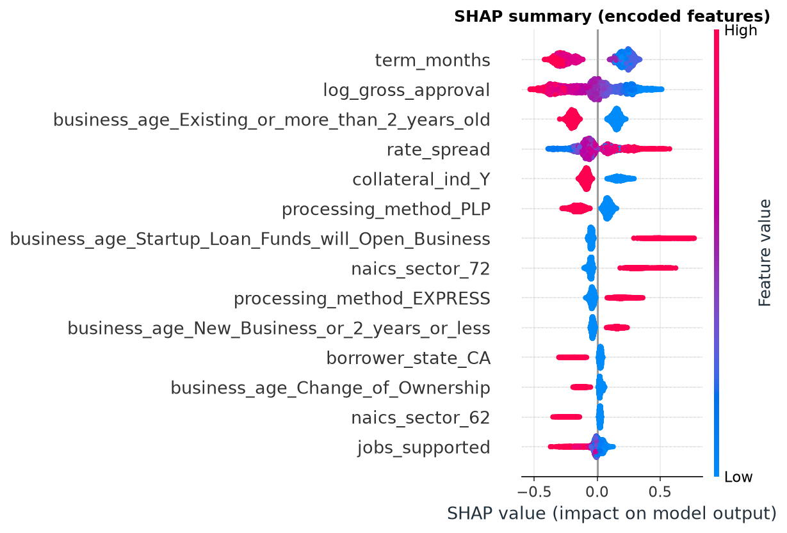</p>

## 4. Leakage control (a deliberate focus)
A PD model may use only what is known **on the approval date**. Excluded, with reasons (full table in [`docs/DATA_DICTIONARY.md`](docs/DATA_DICTIONARY.md) and `src/features.py::LEAKAGE_EXCLUDED`):

| Excluded field | Why |
|---|---|
| `LoanStatus`, `ChargeOffDate` | The outcome / the label's source |
| `GrossChargeOffAmount` | Realised loss, exists only after default |
| `PaidInFullDate` | Exists only after repayment (survivor marker) |
| `SoldSecMrktInd` | Post-origination event; investors buy performing loans |
| `AsOfDate`, `FirstDisbursementDate`, calendar year | Extract date / post-approval event / vintage memorisation (used only to build the window and the split) |
| Names, addresses, bank IDs | Memorisation risk, no generalisable signal |

Enforced in three ways: a **registry + runtime guard** (`assert_no_leakage`), **fit-on-train-only** preprocessing inside sklearn Pipelines, and a **unit test that flips every post-origination field and asserts the feature matrix is unchanged**. Notebook 01 also shows the trap: a "model" using `GrossChargeOffAmount is not null` scores AUC 1.000.

## 5. Business decision: expected loss, cut-off, pricing
**EL = PD × LGD × EAD**, per $ of approval. Assumptions are stated, not hidden:

| Input | Value | Status |
|---|---|---|
| PD | calibrated model output | model |
| EAD | 70% of approval | **data-derived** from charged-off *training* loans (`GrossChargeOffAmount / GrossApproval`), which on the synthetic data simply echoes the generator |
| **LGD** | **45%** | **ASSUMPTION**: FOIA files publish no recoveries; 45% = Basel II foundation-IRB senior unsecured supervisory LGD. Stress-tested 30-70% |
| Net margin | 1.5% p.a. on avg balance | **ASSUMPTION** (after funding, opex, cost of capital) |
| Avg balance / horizon | 85% / 3 years | **ASSUMPTION** |
| ⇒ break-even PD | 12.1% | derived: revenue rate ÷ (LGD × EAD) |

**Recommendation: approve if calibrated 36-month PD ≤ 9.5%; otherwise decline, refer, or reprice.**
Rule: the *tightest* cut-off within 1% of maximum expected profit (chosen on the 2017-18 validation window). Profit is flat near its peak and rests on unverifiable margin/LGD assumptions, so I give up ≤1% of modelled profit for a lower default rate and loss, which makes the recommendation robust to being wrong about those assumptions.

<p align="center">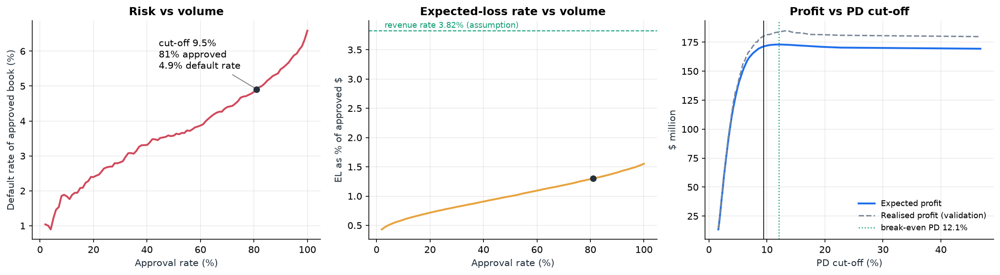</p>

**Impact on the untouched test vintages (2019-21):**

| Strategy | Approved | Default rate | Realised loss rate ($) | Realised profit |
|---|---|---|---|---|
| Approve everyone | 100% | 8.37% | 1.99% | $227M |
| Rules policy (decline start-ups & new restaurants/hotels) | 85% | 7.27% | **1.59%** | $236M |
| Model, same approval rate as rules | 85% | **6.53%** | 1.72% | $242M |
| **Model @ 9.5% cut-off** | **82%** | **6.28%** | 1.68% | **$243M** |

* vs approving everyone: the recommended cut-off **cuts the realised loss rate by 15%** (1.99% → 1.68%), avoids **≈ $56M** of realised loss on $12.4B, and *raises* modelled profit by ≈ $16M.
* vs the manual rules policy at equal volume: the model has a **10% lower default rate** and ≈ $7M more profit, **but a higher *dollar* loss rate (1.72% vs 1.59%)**. The model ranks on PD, not on dollars; this simple rule happens to strip dollar-heavy segments. I am reporting that plainly: the model is clearly better at picking *who* defaults, but a size-aware rule (PD cut-off that tightens with loan size, or ranking on PD × EAD) is the obvious next improvement.
* Model-based EL on the test book ($188M) **under-forecast realised loss ($246M) by 23%**, the calibration drift flowing into dollars.

<p align="center">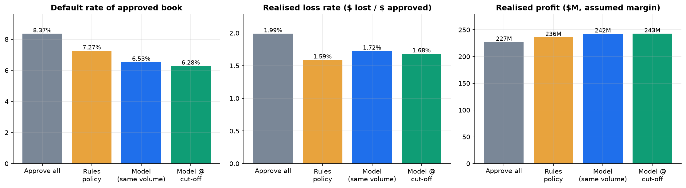</p>

**Robustness:** across LGD 30-70% × margin 1-3% the recommended cut-off ranges from ~4.8% to 15% and the loss-rate reduction vs approve-all stays positive everywhere (5-45%). **Pricing:** going from the safest to the riskiest PD quintile the required spread rises ≈ 1.4 pp vs ≈ 1.0 pp observed, so the riskiest quintile looks under-priced (subject to SBA maximum-rate caps).

<p align="center">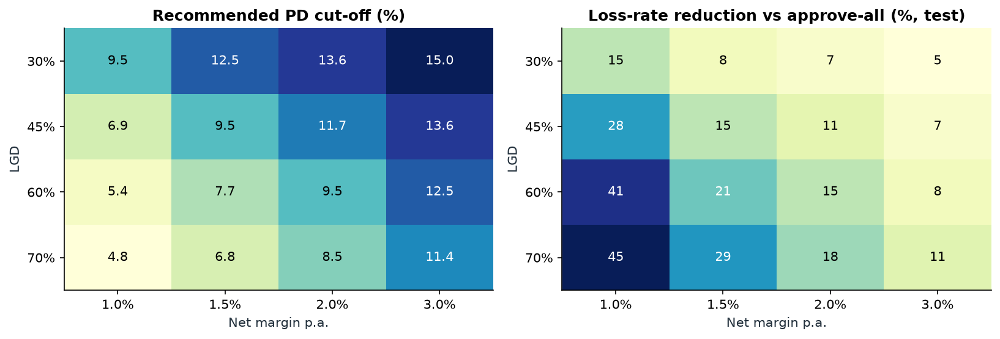 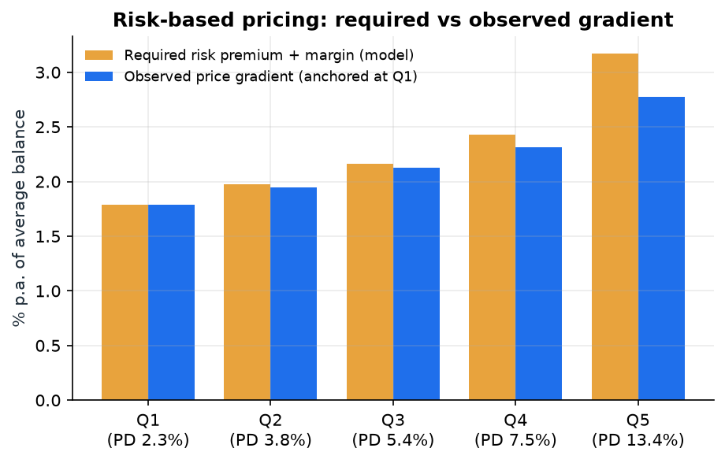</p>

## 6. Run it locally

```bash
git clone https://github.com/J339ABQ/SBA-CREDIT-RISK && cd SBA-CREDIT-RISK
pip install -r requirements.txt            # Python 3.11

# --- the API in one command (a trained model is committed in models/) ---
docker compose up --build                  # then open http://localhost:8000/docs
# or without Docker:  uvicorn api.main:app --reload

curl -s localhost:8000/predict -H 'content-type: application/json' \
  -d "$(python -c "import json;print(json.dumps(json.load(open('data/sample/sample_applications.json'))['risky_startup_restaurant']))")"
# -> {"pd_calibrated":0.50, "decision":"DECLINE", "cutoff":0.0946, "risk_band":5, "top_drivers":[...], ...}
```
Endpoints: `GET /health`, `GET /model-info`, `POST /predict`, `POST /predict/batch` (≤ 1000 loans). Inputs are validated (e.g. guarantee ≤ loan amount, 2-letter state, term 1-480 months → HTTP 422 otherwise). Each response contains the raw PD, **calibrated PD**, decision at the recommended cut-off, risk band, expected loss, and the top-3 risk drivers (exact tree-SHAP reason codes).

**Reproduce the whole analysis**
```bash
make data        # real SBA data if reachable (src/data_download.py), else synthetic stand-in
make train       # tune, calibrate, choose cut-off -> models/pd_model.joblib + reports/metrics.json (~2 min)
make notebooks   # execute the 3 notebooks top-to-bottom, regenerate reports/figures/
make test        # 68 tests
```
**Getting the real data.** `python -m src.data_download` uses the data.sba.gov CKAN API. If your network blocks it, download the 7(a) and 504 CSVs manually from <https://data.sba.gov/dataset/7-a-504-foia> into `data/raw/real/` (keep "504" in the 504 file names) and run `make train notebooks`. *The downloader and the real-schema handling are untested against live SBA files (blocked here); they are written from the published schema, so expect to adjust a column alias if SBA renamed something.*

> Docker note: `docker compose up` could not be executed in the build sandbox (no Docker daemon). I verified the container's contents by running the API from an isolated directory holding only what the Dockerfile copies (`src/`, `api/`, `models/pd_model.joblib`) and calling it over HTTP.

## 7. Project structure
```
data/sample/            small example API requests (raw data is gitignored: data/raw/{real,synthetic})
notebooks/              01_eda · 02_modeling · 03_business_decision (executed, no errors)
scripts/                build_notebooks.py + notebook sources (percent format)
src/                    config · synthetic · data_download · data_prep · features (leakage registry) · modeling
                        evaluation · explain · business (EL/cut-off/pricing) · train (CLI) · predict (inference)
api/                    FastAPI app + pydantic schemas
tests/                  68 tests: target-definition edge cases, leakage, pipeline, metrics, calibration, EL maths, API
models/                 pd_model.joblib (pipeline + calibrator + cut-off + metadata)
reports/                metrics.json, figures/ (all plots embedded above)
docs/DATA_DICTIONARY.md every raw column used, target rule, leakage table
Dockerfile · docker-compose.yml · requirements.txt (full) · requirements-api.txt (runtime) · Makefile
```

## 8. Limitations and what I would do next
* **Synthetic data** (the big one): re-run on the real FOIA files; expect lower AUC and different driver ordering, and check the schema aliases.
* **LGD, margin and balance factors are assumptions**; the 45% LGD is a regulatory placeholder. Replace with the lender's workout data.
* **Selection bias:** FOIA contains only *approved* loans; no reject inference, so the cut-off is validated on the approved population.
* **Guarantee not modelled:** the loss view is at full exposure; a lender-specific view would apply the SBA guarantee (50-85% for 7(a)).
* **Cycle drift:** calibration degraded under the 2020 shock. Next: quarterly predicted-vs-observed monitoring, intercept recalibration, a macro overlay or a discrete-time survival model.
* **Dollar-aware decisioning:** rank on PD × EAD or use size-tiered cut-offs (see §5).
* Possible extras: lender-level features and monotonic constraints, fairness/adverse-action review, SHAP-based adverse-action reason text, CI (GitHub Actions) running `make test`.
